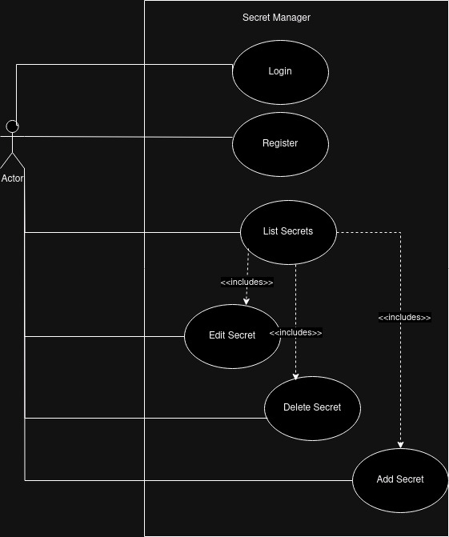
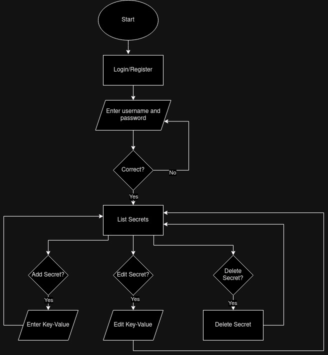
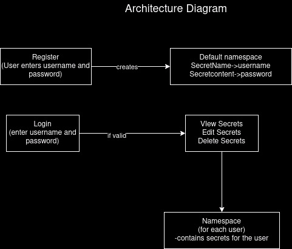

# Secret Manager
Welcome to Secret Manager.

# Introduction

Secret Manager is an application designed to manage secrets using a backend built with Go (Golang) and a frontend built with React. The application leverages Kubernetes (K8s) for secret storage and management. Users can register and log in with a username and password. User credentials are stored as Kubernetes secrets in the default namespace, and after successful registration, a unique namespace is created for each user where they can store their secrets. The application provides an API for CRUD (Create, Read, Update, Delete) operations on secrets.

## Architecture





## Requirements

### System Requirements
- **Go (Golang)**: Version 1.22 or higher
- **Node.js**: Version 20.x or higher
- **Kubernetes**: Version 1.19 or higher
- **Docker**: Version 27.0.3 or higher

### Dependencies

#### Backend (Go)
- **gin-gonic/gin**: Web framework for building API endpoints
- **k8s.io/client-go**: Go client for Kubernetes API

#### Frontend (React)
- **react**: JavaScript library for building user interfaces

## Installation

## From source code
### Backend Setup

1. **Clone the Repository**:
   ```sh
   git clone https://gitlab.01cloud.com/learners-group/secret-manager.git
   cd secret-manager
   ```

2. **Install Go Dependencies**:
    ```sh
    go mod tidy
    ```

3. **Set Up Kubernetes**:

    Ensure your Kubernetes cluster is running and kubectl is configured to interact with it. The application will use this configuration to interact with Kubernetes secrets and namespaces.
    

4. **Run the Backend Server**.
    ```sh
    go run main.go
    ```
### Frontend Setup

1. **Navigate to Frontend Directory**.
   ```sh
   cd ./frontend
   ``` 

2. **Install Dependencies**.
    ```sh
    npm install
   ``` 

3. **Run the Frontend**.
    ```sh
   npm run dev
   ``` 
   
## Using manifest
### Setup MetalLB
    MetalLB is a load-balancer implementation for Kubernetes clusters, providing the ability to expose services externally.

1. **Run the MetalLB setup script**:
    ```sh
    bash metallb_setup.sh
    ```

### Setup Nginx Ingress
    Nginx Ingress Controller is used to manage access to services in a Kubernetes cluster, typically HTTP and HTTPS services.

1. **Apply Nginx Ingress Manifest**:
    ```sh
    kubectl apply -f https://raw.githubusercontent.com/kubernetes/ingress-nginx/main/deploy/static/provider/cloud/deploy.yaml
    ```

### Deploying Secret Manager
1. **Apply the Secret Manager Deployment**:
    ```sh
    kubectl apply -f sm-deployment.yaml
    ```

2. **Apply the MetalLB Manifest**:
    ```sh
    kubectl apply -f sm-metallb.yaml
    ```

3. **Apply the Ingress Manifest**:
    ```sh
    kubectl apply -f sm-ingress.yaml
    ```

**Access the Frontend using http://sm-ui.pratik.np**

**Put http://sm-api.pratik.np in API_URL**

